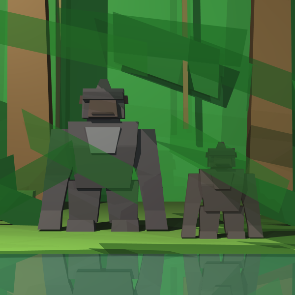
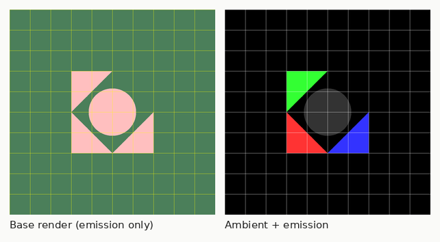
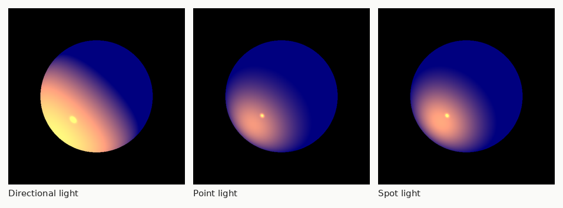
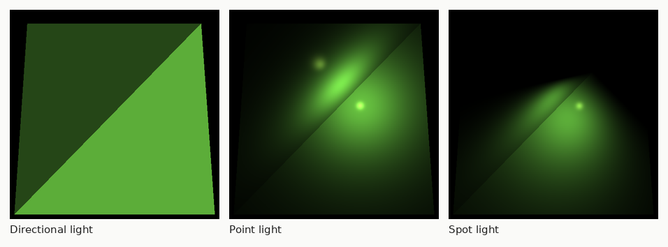
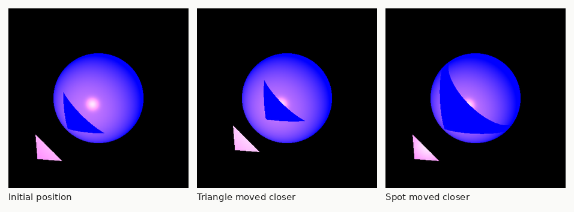
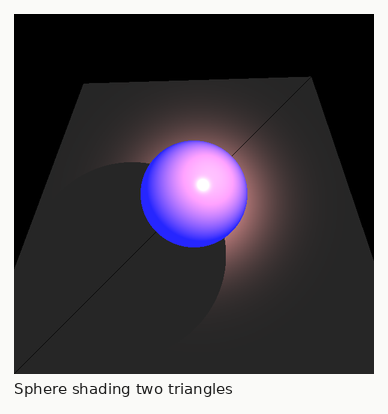
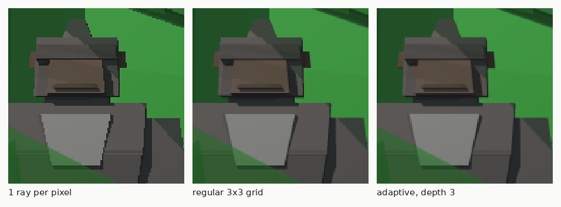
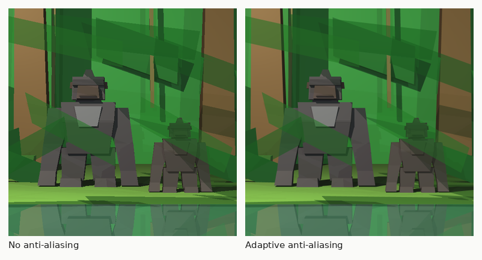

# Raytracing Project

### Building a ray tracer from scratch: from points and vectors to two gorillas in a jungle

**Course:** Mini Project — Introduction to Software Engineering (ISE5783_6686_6223)
**Author:** Haim Hai Benyounes
**Language / tooling:** Java 21, JUnit 5, IntelliJ IDEA
**Final deliverable:** `unitTests/renderer/JungleGorillasTests.java` → `images/gorillasJungle.png`



---

## 1. What this project is

The goal of the project is to write, from nothing, a **ray tracing renderer** in
Java, and then to use it to produce an original picture. Nothing is imported
from a graphics library: every point, every vector, every intersection formula
and every lighting equation is implemented and unit-tested by hand.

The project was built **bottom-up, one layer at a time**, and this is the most
important thing to understand about its structure. Each layer is only started
once the layer below it is fully covered by unit tests:

| Stage | What is added | How it is validated |
|---|---|---|
| 1 | Primitives: `Double3`, `Point`, `Vector`, `Ray`, `Util`, `Color` | Pure unit tests on algebra |
| 2 | Geometries and their intersections | Unit tests with equivalence partitions and boundary values |
| 3 | Camera, view plane, `ImageWriter` | Unit tests + a camera/geometry integration test |
| 4 | Ray tracer and scene: first images | Visual tests (`RenderTests`) |
| 5 | Lights and the Phong reflection model | One picture per light type (`LightingTests`) |
| 6 | Shadows | A series of pictures with a moving occluder (`ShadowTests`) |
| 7 | Transparency and reflection | `ReflectionRefractionTests`, `ImageLevel7Tests` |
| 8 | **Our own picture**: two gorillas in a jungle | `JungleGorillasTests` |
| 9 | Picture improvement: anti-aliasing; performance: adaptive supersampling and multi-threading | Before/after comparison and timing measurements |

In total the project contains **19 test classes and 50 test methods**. Tests are
not an afterthought here: in a renderer, a sign error in a cross product does not
throw an exception, it silently produces a picture that looks *almost* right.
The only practical defence is to test each formula in isolation before it is
buried under three layers of recursion.

---

## 2. Stage 1 — The primitives

### 2.1 Design

Everything is built on `Double3`, an immutable triple of doubles with the basic
algebra (`add`, `subtract`, `scale`, `product`, `reduce`, `lowerThan`). Two
constants, `Double3.ZERO` and `Double3.ONE`, are reused throughout the engine.

- **`Point`** wraps a `Double3`. `point.subtract(otherPoint)` returns a
  `Vector` (the vector between two points), while `point.add(vector)` returns a
  `Point`. The type system therefore enforces the geometric meaning of each
  operation: you cannot accidentally add two points.
- **`Vector` extends `Point`** and adds `length`, `lengthSquared`, `normalize`,
  `dotProduct`, `crossProduct`, `scale`. Its constructor **rejects the zero
  vector**:

```java
public Vector(double x, double y, double z) {
    super(x, y, z);
    if (xyz.equals(Double3.ZERO))
        throw new IllegalArgumentException("Vector can't be 0");
}
```

  This is a deliberate design decision: a zero vector has no direction, so any
  code path that produces one is a bug. Making it throw turns a silent
  wrong-picture bug into an exception with a stack trace.

- **`Ray`** is a point plus a normalised direction, with `getPoint(t)` returning
  the point at distance `t` along the ray, and `findClosestPoint` /
  `findClosestGeoPoint` returning the nearest element of a list.
- **`Util`** solves the floating-point accuracy problem. Rather than comparing to
  an arbitrary epsilon, it inspects the **binary exponent** of the double:

```java
private static final int ACCURACY = -40;   // ~1e-12 in decimal

public static boolean isZero(double number) { return getExp(number) < ACCURACY; }
public static double alignZero(double number) {
    return getExp(number) < ACCURACY ? 0.0 : number;
}
```

  `isZero` and `alignZero` are used in every intersection routine; without them,
  a ray that grazes a surface produces `t = 1e-17` instead of `0` and the surface
  shadows itself.

- **`Color`** wraps a `Double3` of RGB components. It is *not* clamped during the
  computation — intensities may exceed 255 while colours are being added — and is
  only clamped when converted to a `java.awt.Color` for writing:

```java
public java.awt.Color getColor() {
    int ir = (int) rgb.d1; /* ... */
    return new java.awt.Color(ir > 255 ? 255 : ir, /* ... */);
}
```

### 2.2 Testing methodology

From this stage on, every test follows the course methodology: the input domain
is split into **Equivalence Partitions** (`TC01`, `TC02`, …), and the edges of
those partitions are tested separately as **Boundary Values** (`TC11`, `TC12`, …
or `BV01`, `BV02`, …). `VectorTests.testCrossProduct` is a typical example:

```java
// ============ Equivalence Partitions Tests ==============
// TC01: Test that length of cross-product is proper (orthogonal vectors taken)
// TC02: Test cross-product result orthogonality to its operands
// =============== Boundary Values Tests ==================
// TC11: test zero vector from cross-product of co-lined vectors
```

`PointTest` (5 methods) covers `equals`, `add`, `subtract`, `distance` and
`distanceSquared`; `VectorTests` (9 methods) covers the whole vector algebra;
`RayTests` checks `findClosestPoint` for an empty list and for the closest point
being first, last or in the middle.

---

## 3. Stage 2 — Geometries and intersections

### 3.1 The abstraction

Two abstract classes structure the whole geometry package:

- **`Intersectable`** defines the intersection API as a *template method*:

```java
public final List<GeoPoint> findGeoIntersections(Ray ray, double maxDistance) {
    return findGeoIntersectionsHelper(ray, maxDistance);
}
public final List<GeoPoint> findGeoIntersections(Ray ray) {
    return findGeoIntersections(ray, Double.POSITIVE_INFINITY);
}
protected abstract List<GeoPoint> findGeoIntersectionsHelper(Ray ray, double maxDistance);
```

  A `GeoPoint` is the pair *(geometry, point)*. This pairing is essential: when
  the ray tracer finds the closest hit, it must know **which** object was hit in
  order to read its colour and its material.

- **`Geometry extends Intersectable`** adds `getNormal(Point)`, an `emission`
  colour and a `Material`, both with builder-style setters returning `this`, which
  is what makes scene construction readable:

```java
new Sphere(new Point(0, 0, -50), 50d)
        .setEmission(new Color(BLUE))
        .setMaterial(new Material().setkD(0.4).setkS(0.3).setnShininess(100));
```

### 3.2 The shapes

| Shape | Intersection method |
|---|---|
| `Plane` | `t = n·(q₀ − p₀) / (n·v)`; returns nothing when `n·v ≈ 0` (ray parallel to the plane) |
| `Sphere` | geometric method: project the centre on the ray (`tm`), compute the distance to the axis (`d`), then `th = √(r² − d²)` and the roots `tm ± th` |
| `Triangle` | intersect the supporting plane, then test that the ray is on the same side of the three edges (sign of `v·(vᵢ × vⱼ)`) |
| `Polygon` | same idea generalised to *N* vertices; the constructor also validates the polygon |
| `Tube`, `Cylinder` | infinite/finite cylinder, plus the normal on the caps |
| `Geometries` | **composite**: holds a list of `Intersectable` and concatenates their results |

`Polygon` deserves a note because the final picture is built entirely from
polygons. Its constructor **rejects** any polygon that is not usable:

```java
boolean positive = edge1.crossProduct(edge2).dotProduct(n) > 0;
for (var i = 1; i < vertices.length; ++i) {
    if (!isZero(vertices[i].subtract(vertices[0]).dotProduct(n)))
        throw new IllegalArgumentException(
                "All vertices of a polygon must lay in the same plane");
    /* ... */
    if (positive != (edge1.crossProduct(edge2).dotProduct(n) > 0))
        throw new IllegalArgumentException(
                "All vertices must be ordered and the polygon must be convex");
}
```

Three properties are enforced: **coplanarity**, **convexity**, and **correct
vertex ordering**. Section 9 explains how the gorillas were designed so that
every single face satisfies them by construction.

### 3.3 Testing

This is where the equivalence-partition method pays off. `SphereTests`
enumerates **15 cases**: ray missing the sphere, crossing it twice, starting
inside, pointing away, starting exactly on the surface going in or out, passing
through the centre, tangent before / at / after the tangency point, and so on.
`PlaneTests` covers parallel, orthogonal and oblique rays, plus the degenerate
case where the ray starts on one of the three defining points. `PolygonTests`
checks that the constructor *refuses* wrong vertex order, non-coplanar vertices,
a concave quadrangle, a repeated vertex and co-located points. `GeometriesTests`
checks the composite itself: empty collection, no intersection at all, exactly
one shape hit, all shapes hit.

---

## 4. Stage 3 — Camera, view plane and image writer

The camera is defined by a location and an orthonormal basis (`vTo`, `vUp`,
`vRight = vTo × vUp`), plus a view plane of a given width, height and distance.
The constructor refuses non-orthogonal vectors. The core method builds the ray
through the centre of pixel *(j, i)*:

```java
double Ry = height / nY,  Rx = width / nX;
double Xj =  (j - (nX - 1d) / 2) * Rx;
double Yi = -(i - (nY - 1d) / 2) * Ry;
```

`ImageWriter` owns the pixel matrix and writes the PNG file;
`printGrid(interval, color)` draws a coloured grid over the image and was used to
validate it before any ray tracing existed at all (`ImageWriterTests`).

Two kinds of tests are used here:

- **`CameraTests.testConstructRay`** — pure unit test, comparing the constructed
  ray against hand-computed expected rays: one equivalence partition (a 4×4 view
  plane, inner pixel) and six boundary values (3×3 centre, centre of the upper
  side, centre of the left side, corners of a 3×3 and of a 4×4 grid).
- **`IntegrationRayCamera`** — the first *integration* test: a 3×3 view plane is
  built, all nine rays are constructed, and the **total number of intersection
  points** with a shape is compared with the number obtained by hand. Spheres of
  increasing size around the camera give 2, 18, 10, 0 and 0 points; planes at
  three orientations give 9, 9 and 6; triangles give 1 and 2. This test is what
  proves that the camera module and the geometry module agree with each other —
  each one could be correct in isolation and still be inconsistent together.

---

## 5. Stage 4 — First images

`RayTracerBase` is an abstract class holding the scene and declaring
`traceRay(Ray)`. `RayTracerBasic` implements it. The `Scene` is a plain data
holder: name, background colour, ambient light, `Geometries`, list of light
sources.

At this stage `calcColor` returns only the ambient light plus the geometry's own
emission, which is enough to check the whole pipeline — camera → rays →
intersections → closest point → colour → file:



`RenderTests` produces these two pictures, plus a third one prepared for a bonus
feature (building the scene from an XML file).

---

## 6. Stage 5 — Lights and the Phong reflection model

### 6.1 The light hierarchy

```
Light (abstract, holds intensity)
 ├── AmbientLight
 └── (implements LightSource: getIntensity(p), getL(p), getDistance(p))
      ├── DirectionalLight
      ├── PointLight
      └── SpotLight extends PointLight
```

The `LightSource` interface is the key abstraction: the ray tracer never asks
what *kind* of light it is dealing with, it only asks for the intensity at a
point, the direction from the light to that point, and the distance to the light
(needed later for shadows).

| Light | Intensity at *p* | Direction `getL(p)` | Distance |
|---|---|---|---|
| `AmbientLight` | `Ia · Ka`, constant, added once per ray | — | — |
| `DirectionalLight` | constant — models the sun, infinitely far | fixed direction | `+∞` |
| `PointLight` | `I₀ / (kC + kL·d + kQ·d²)` | `p − position`, normalised | `d` |
| `SpotLight` | point light **×** `max(0, direction · l)` | inherited | inherited |

The attenuation factors are what make a point light look physical: `kC` is a
constant term, `kL` a linear one, `kQ` a quadratic one. In practice `kQ` is the
interesting one — it makes distant objects fall off much faster than near ones,
and Section 10 shows how it was used deliberately to darken the background of the
final picture.

`SpotLight` simply multiplies by the cosine between the beam axis and the
direction to the point, and returns black behind the beam:

```java
double dl = alignZero(getL(p).dotProduct(this.direction));
if (dl <= 0) return Color.BLACK;
return super.getIntensity(p).scale(dl);
```

### 6.2 The Phong model

For each light source, the colour of a point is the sum of a **diffuse** and a
**specular** term:

```java
private Double3 calcDiffusive(Material material, double nl) {
    return material.kD.scale(Math.abs(nl));
}
private Double3 calcSpecular(Material material, Vector n, Vector l, double nl, Vector v) {
    Vector r = l.subtract(n.scale(2 * nl));
    double cosTeta = alignZero(-v.dotProduct(r));
    return cosTeta <= 0 ? Double3.ZERO
            : material.kS.scale(Math.pow(cosTeta, material.nShininess));
}
```

`kD` controls how much light is scattered in all directions, `kS` how much is
mirrored towards the viewer, and `nShininess` how tight the highlight is. The
test `nl * nv > 0` in `calcLocalEffects` skips lights that are behind the
surface relative to the viewer.

### 6.3 Testing

`LightingTests` renders the same two scenes — a sphere, then two triangles —
once for each type of light. Comparing the three pictures is the test: a
directional light gives uniform illumination, a point light gives a hot spot that
fades with distance, a spot light gives a visible cone.





---

## 7. Stage 6 — Shadows

A point is in shadow if something lies between it and the light. The test is a
second ray, the **shadow ray**, cast from the point towards the light source:

```java
private Double3 transparency(GeoPoint geoPoint, LightSource lightSource, Vector l, Vector n) {
    Ray lightRay = new Ray(geoPoint.point, l.scale(-1), n);
    List<GeoPoint> intersections = scene.geometries.findGeoIntersections(lightRay);
    Double3 ktr = Double3.ONE;
    if (intersections == null) return ktr;
    double distance = lightSource.getDistance(geoPoint.point);
    for (GeoPoint intersection : intersections)
        if (distance > intersection.point.distance(geoPoint.point))
            ktr = ktr.product(intersection.geometry.getMaterial().kT);
    return ktr;
}
```

Three details matter here:

1. **Only blockers closer than the light count.** An object *behind* the light
   source does not cast a shadow, hence the comparison with
   `lightSource.getDistance(...)` — and hence the need for `getDistance` in the
   `LightSource` interface, which returns `+∞` for a directional light.
2. **The result is a coefficient, not a boolean.** Returning the accumulated
   product of the `kT` of the blockers means the same routine handles opaque
   shadows (`kT = 0` → nothing gets through) and **partial shadows** through
   translucent objects (`0 < kT < 1`) with no special case.
3. **Self-shadowing ("shadow acne").** The shadow ray starts exactly on the
   surface, so it immediately re-intersects the surface it came from. The
   three-argument constructor `Ray(p0, direction, normal)` offsets the origin by
   `DELTA = 0.1` along the normal, on the correct side:

```java
public Ray(Point p0, Vector direction, Vector normal) {
    Vector delta = normal.scale(normal.dotProduct(direction) > 0 ? DELTA : -DELTA);
    this.p0 = p0.add(delta);
    this.dir = direction;
}
```

`ShadowTests` validates this by rendering the same sphere-and-triangle scene
several times, moving the triangle closer to the sphere and then moving the spot
light closer, and checking that the shadow follows and sharpens as expected:





---

## 8. Stage 7 — Transparency and reflection

Two new material coefficients complete the model: `kT` (transmission) and `kR`
(reflection). Both are handled by the same recursive mechanism — the colour at a
hit point is the local Phong colour **plus** the colour brought back by two
secondary rays:

```java
private Color calcGlobalEffects(GeoPoint gp, Ray ray, int level, Double3 k) {
    Material material = gp.geometry.getMaterial();
    Vector n = gp.geometry.getNormal(gp.point);
    Ray reflectedRay = constructReflectedRay(gp, n, ray.getDir());
    Ray refractedRay = constructRefractedRay(gp, n, ray.getDir());
    return calcGlobalEffects(gp, level, color, material.kR, k, reflectedRay)
            .add(calcGlobalEffects(gp, level, color, material.kT, k, refractedRay));
}
```

The reflected ray is `r = v − 2(v·n)n`; the transmitted ray keeps the original
direction (no refraction index is modelled). Two guards stop the recursion:

- `MAX_CALC_COLOR_LEVEL = 10` — a hard depth limit;
- `MIN_CALC_COLOR_K = 0.01` — the accumulated coefficient `k` is multiplied at
  each bounce, and when `kkx.lowerThan(MIN_CALC_COLOR_K)` the contribution is too
  small to be visible and the branch is abandoned.

The second guard is the one that actually does the work: a ray that has already
crossed three surfaces of `kT = 0.4` carries `0.064` of the original weight and is
dropped. Without it, a scene with two facing mirrors would recurse until the
depth limit on every single pixel.

`ReflectionRefractionTests` validates the feature with a transparent sphere
containing an opaque one, a pair of spheres between two mirrors, and a
translucent sphere casting a **partial shadow** on two triangles — the exact
combination that the final picture reuses.

---

## 9. Stage 8 — Our own picture: two gorillas in a jungle

The brief for the final picture: two three-dimensional gorillas, **built only
from polygons**, in a jungle, using transparency and shadows. The scene contains
**356 polygons** — 138 per gorilla (276 in total) and 80 for the environment.

### 9.1 One primitive for everything: the tapered prism

Since `Polygon` accepts only planar convex faces, the whole model is built from a
single helper: a **right prism with a rectangular base, possibly tapered**. Its
bottom section (centre `base`, half-sides `bx`, `bz`) and its top section
(centre `top`, half-sides `tx`, `tz`) may have **different sizes** and
**offset centres**:

```java
private static void addPrism(Geometries geometries, Point base, Point top,
                             double bx, double bz, double tx, double tz,
                             Color emission, Material material) {
    Point b1 = new Point(x0 - bx, y0, z0 - bz);   /* ... 8 vertices ... */
    geometries.add(
        new Polygon(b1, b2, b3, b4)...,   // bottom
        new Polygon(t1, t2, t3, t4)...,   // top
        new Polygon(b4, b3, t3, t4)...,   // front
        new Polygon(b1, b2, t2, t1)...,   // back
        new Polygon(b1, t1, t4, b4)...,   // left
        new Polygon(b2, b3, t3, t2)...);  // right
}
```

That freedom is what allows a barrel chest, a tapering tree trunk or a slanted
arm without ever leaving the polygon primitive.

**Why the side faces stay planar.** Take the front face. Its two bottom vertices
lie at `z = z0 + bz` and differ only in `x`; its two top vertices lie at
`z = z1 + tz` and also differ only in `x`. The two horizontal edges are therefore
both **parallel to the x axis**, and two parallel lines are always coplanar. The
same argument applies to the left and right faces (edges parallel to the z axis).
Each face is a trapezoid, hence convex, and the vertex order follows the contour.
`Polygon`'s validation therefore never fails, whatever proportions are chosen —
this is a proof, not an empirical observation.

### 9.2 The gorilla rig

The inner class `GorillaBuilder` works in a **local frame**: feet at `y = 0`,
animal facing the camera (`+z`), about 165 units tall. A single method maps that
frame to the scene:

```java
private Point p(double x, double y, double z) {
    return new Point(cx + x * scale, y * scale, cz + z * scale);
}
```

Any number of gorillas, at any size and position, can therefore be instantiated
from the same rig — which is exactly what the picture does: the male at scale
1.0, the young one at 0.58.

| Body part | Volumes | Note |
|---|---|---|
| Feet and legs | 4 | short and massive, near-square sections |
| Torso | 3 | narrow hips → very wide shoulders, plus the chest plate |
| Arms | 6 | upper arm, forearm, fist — offset in `x` to slant them |
| Neck, skull, sagittal crest | 3 | the crest is the small volume on top of the skull |
| Brow ridge, muzzle, mouth | 3 | volumes protruding towards `+z` |
| Eyes and ears | 4 | more specular materials |
| **Total** | **23 prisms = 138 polygons** | |

The environment uses the same prism for tree trunks, rocks and lianas, plus a
second helper for foliage: `addLeaf` builds a **parallelogram** from a centre and
two half-diagonals — a figure that is planar and convex by construction, so it is
always a legal `Polygon`.

### 9.3 A trap in the Phong implementation

The diffuse term of this engine is `material.kD.scale(|n·l|)`: it does **not**
involve the geometry's own colour, which is only added as a constant `emission`
term. Consequently, using the scalar setter `setkD(double)` makes `kD` a grey
`Double3`, and **every lit surface tends towards white**. The first renders of
the jungle came out milky green with light grey gorillas.

The fix is to give `kD` a **colour**, i.e. to use the per-channel albedo:

```java
private static final Material FUR_MAT = new Material()
        .setkD(new Double3(0.10, 0.095, 0.11)).setkS(new Double3(0.06)).setnShininess(30);
private static final Material GROUND_MAT = new Material()
        .setkD(new Double3(0.17, 0.26, 0.12)).setkS(new Double3(0.05)).setnShininess(10);
```

`emission` is then only used to keep shadowed areas from falling to pure black —
it plays the role of a per-object ambient term.

### 9.4 Lights

| Source | Role | Setting |
|---|---|---|
| `SpotLight` (−380, 620, 320) | sunbeam through the canopy; this is what draws the shadows | `kL = 3·10⁻⁴`, `kQ = 6·10⁻⁷` |
| `PointLight` (430, 300, 460) | green bounce from the foliage, right side | strong attenuation |
| `PointLight` (−120, 260, 700) | cool fill on the camera side, separates the subjects from the background | very weak |

The quadratic attenuation `kQ` was deliberately increased: it makes light fall
off with distance, which **darkens the far background** without touching the
subjects and makes the picture readable.

The direction of the spot was chosen so that the cast shadows land **inside the
visible frame**. From a point at height `h`, the shadow is offset on the ground
by `h × (horizontal / vertical component)` of the light direction; with the
chosen direction, the shadow of the adult's head (165 units) lands between the
two animals, on clear ground.

### 9.5 Transparency in the scene

```java
/** Translucent leaf: this is what produces the green partial shadows. */
private static final Material LEAF_MAT = new Material()
        .setkD(new Double3(0.09, 0.30, 0.11)).setkS(new Double3(0.16)).setnShininess(60)
        .setkT(new Double3(0.42, 0.55, 0.42));

/** Water: transparent AND slightly reflective. */
private static final Material WATER_MAT = new Material()
        .setkD(new Double3(0.03, 0.05, 0.06)).setkS(new Double3(0.45)).setnShininess(300)
        .setkT(new Double3(0.38, 0.45, 0.45)).setkR(new Double3(0.40));
```

1. **The large foreground leaves.** `kT` is deliberately **higher on the green
   channel** than on the other two, so light that crosses a leaf comes out green,
   as it does in reality. One of them passes in front of the big gorilla — his
   arm is visible through it.
2. **The off-screen leaves above the scene.** They are never seen directly, but
   they sit on the path of the spot light: they tint and attenuate the light
   reaching the ground, which is exactly the partial-shadow mechanism of
   Section 7.
3. **The water sheet** in the foreground combines `kT` and `kR`: the ground shows
   through it and the two gorillas are reflected on its surface.

### 9.6 The picture, before any improvement

Rendered at 600 × 600 with one ray per pixel, single-threaded: **35 s**.


The scene is right, the lighting is right — but every oblique edge is a staircase.
That is the subject of the last stage.

---

## 10. Stage 9 — Improving the picture and the performance

### 10.1 Where the jaggies come from

The original `renderImage` casts **one single ray per pixel**, through its
centre. Each pixel therefore takes the full colour of whatever object happens to
sit exactly in its middle: an edge crossing a pixel is decided by an all-or-
nothing vote. This is **aliasing**, and raising the resolution does not remove
it, it only makes the steps smaller.

### 10.2 Generalising the ray construction

Everything that follows requires aiming at an **arbitrary** point of a pixel, not
only its centre. `constructRay` is therefore rewritten in terms of continuous
coordinates, where the centre of pixel *(j, i)* is the point *(j + 0.5, i + 0.5)*:

```java
public Ray constructRayThroughPoint(int nX, int nY, double u, double v) {
    Point Pij = location.add(vTo.scale(distance));
    double Xj =  (u - nX / 2d) * (width  / nX);
    double Yi = -(v - nY / 2d) * (height / nY);
    if (!isZero(Xj)) Pij = Pij.add(vRight.scale(Xj));
    if (!isZero(Yi)) Pij = Pij.add(vUp.scale(Yi));
    return new Ray(location, Pij.subtract(location));
}

public Ray constructRay(int nX, int nY, int j, int i) {
    return constructRayThroughPoint(nX, nY, j + 0.5, i + 0.5);
}
```

Since `(j + 0.5) − nX/2 = j − (nX − 1)/2`, the computation is **rigorously
identical** to the original one for pixel centres, so `CameraTests` and
`IntegrationRayCamera` keep passing unchanged.

### 10.3 Regular supersampling

`setAntiAliasing(n)` casts an `n × n` grid of rays inside the pixel and averages
the results. It is simple and it works, but the cost is multiplied by `n²`
**everywhere**, including in the large uniform areas where every ray returns the
same colour — that is, in the vast majority of the image.

### 10.4 Adaptive supersampling

`setAdaptiveAntiAliasing(depth)` spends rays only where they matter. The four
**corners** of the pixel are evaluated; if they are practically identical, the
area is considered uniform and their average is returned; otherwise the square is
split into four and the process repeats down to the maximum depth. Already
computed colours are passed down to the recursive calls:

```java
private Color adaptive(int nX, int nY, double u, double v, double size, int depth,
                       Color topLeft, Color topRight, Color bottomLeft, Color bottomRight) {
    if (depth == 0 || (similar(topLeft, topRight) && similar(topLeft, bottomLeft)
            && similar(topLeft, bottomRight)))
        return average(topLeft, topRight, bottomLeft, bottomRight);

    double h = size / 2;
    Color center = colorAt(nX, nY, u + h, v + h);
    Color top    = colorAt(nX, nY, u + h, v);
    /* ... bottom, left, right ... */

    return average(
        adaptive(nX, nY, u,     v,     h, depth - 1, topLeft, top,      left,       center),
        adaptive(nX, nY, u + h, v,     h, depth - 1, top,     topRight, center,     right),
        adaptive(nX, nY, u,     v + h, h, depth - 1, left,    center,   bottomLeft, bottom),
        adaptive(nX, nY, u + h, v + h, h, depth - 1, center,  right,    bottom,     bottomRight));
}
```

One further optimisation matters a great deal: a pixel corner is **shared by four
neighbouring pixels**. A `Color[nX+1][nY+1]` array memoises them, so a perfectly
uniform area costs **one ray per pixel** — the same price as the original
renderer, for a better result:

```java
private Color corner(Color[][] cache, int nX, int nY, int u, int v) {
    Color c = cache[u][v];
    if (c == null) { c = colorAt(nX, nY, u, v); cache[u][v] = c; }
    return c;
}
```

The decision threshold is the constant `ADAPTIVE_TOLERANCE = 6` (maximum
per-channel difference out of 255). The lower it is, the sharper the image and
the longer the render.

### 10.5 Multi-threading

Ray tracing is embarrassingly parallel: every pixel is independent.
`setMultithreading(n)` distributes **one image row per task**; `0` uses every
core of the machine.

```java
ForkJoinPool pool = new ForkJoinPool(threadsCount);
try {
    pool.submit(() -> IntStream.range(0, nY).parallel().forEach(i -> {
        for (int j = 0; j < nX; ++j)
            imageWriter.writePixel(j, i, pixelColor(nX, nY, j, i, corners));
    })).join();
} finally {
    pool.shutdown();
}
```

Two safety points: no two tasks ever write to the same pixel (each owns its row),
and in the worst case two threads compute the same corner twice — since the value
is identical, the race is harmless.

### 10.6 Measurements

Same scene, 420 × 420, on a **2-core** machine:

| Configuration | Time | Ratio |
|---|---:|---:|
| 1 ray/pixel, single thread (original) | 19.4 s | ×1.0 |
| 1 ray/pixel, 2 threads | 10.9 s | ×0.56 |
| Regular 3 × 3 grid (9 rays/pixel), 2 threads | 80.3 s | ×4.1 |
| Adaptive, depth 2, 2 threads | 29.7 s | ×1.5 |
| Adaptive, depth 3, 2 threads | 55.3 s | ×2.9 |

Adaptive depth 3 subdivides down to 8 × 8 subsamples on edges — finer than the
3 × 3 grid — while being **31 % faster** than it, because those rays are only
spent on contours. This is the configuration used for the final image:
**600 × 600 in 1 min 27**, against 35 s for the original renderer with no
anti-aliasing at all.

### 10.7 Before and after





---

## 11. Engine fixes made along the way

| File | Problem | Fix |
|---|---|---|
| `src/geometries/Polygon.java` | `alignZero` not imported | `import static primitives.Util.*;` |
| `src/geometries/Tube.java` | `List` / `LinkedList` not imported | `import java.util.*;` |
| `src/geometries/Cylinder.java` | same | `import java.util.*;` |

To which the design point of Section 9.3 must be added: a scalar `kD`
desaturates every directly lit surface.

---

## 12. Limits and future work

- **No acceleration structure.** `Geometries.findGeoIntersectionsHelper` tests
  all 356 polygons linearly for every ray. A bounding volume hierarchy (BVH)
  would bring this down to `O(log n)` and allow much higher resolutions or much
  richer scenes. This is by far the highest-value next step.
- **Hard shadows.** All sources are point-like, so shadow edges are perfectly
  sharp. Soft shadows would come from sampling an area light with several shadow
  rays per point.
- **Perfectly specular reflection.** The water reflects like a mirror; sampling a
  cone around the reflected ray would give a glossy, more realistic reflection.
- **No refraction index.** The transmitted ray keeps the original direction, so
  transparent objects do not bend light. Implementing Snell's law would make
  glass look like glass.
- **Pinhole camera.** Everything is in focus at every distance. Sampling an
  aperture would produce depth of field.
- **Modelling.** The gorillas are assemblies of boxes; hexagonal or octagonal
  prisms would smooth the silhouettes at a modest cost.

---

## 13. Reproducing the final image

1. Apply the three import fixes of Section 11.
2. Replace `src/renderer/Camera.java` with the improved version (anti-aliasing +
   multi-threading; the existing API is preserved).
3. Copy `JungleGorillasTests.java` into `unitTests/renderer/`.
4. Run the test `twoGorillasInTheJungle()`. The image is written to
   `images/gorillasJungle.png`.

The `RES` constant at the top of the class sets the resolution (600 by default);
to iterate quickly on the scene, lower it to 250 and comment out the
`.setAdaptiveAntiAliasing(3)` line.
